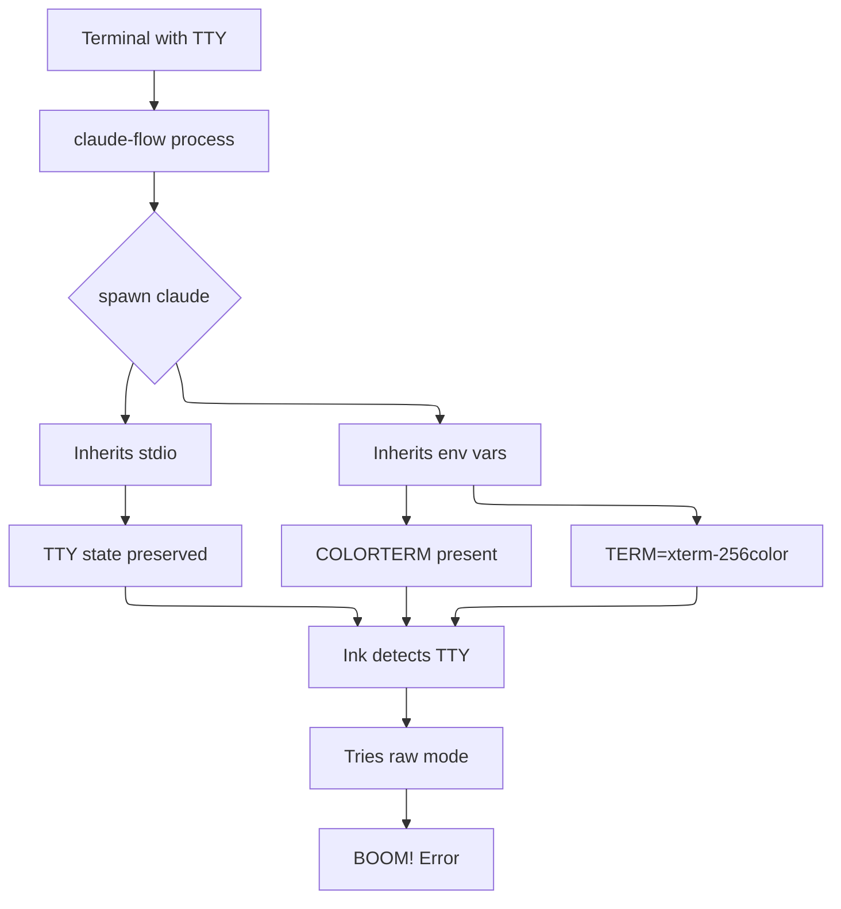

# Do or Do Not, There Is No TTY

> A tale of Ink, raw mode errors, and the quest to make Claude Code play nice with claude-flow

## Prelude: A Partnership of Innovation

We have tremendous respect for Claude Code - it has been a key disruptor in the AI coding assistant space, fundamentally changing how developers interact with AI. After many searches for ways to enhance and orchestrate Claude's capabilities, we discovered [claude-flow](https://github.com/ruvnet/claude-flow) - a remarkable add-on that serves as the perfect partner, enabling multi-agent orchestration, memory persistence, and advanced workflow management.

This is the story of making these two powerful tools work together seamlessly.

## The Problem: When Ink Strikes Back

Picture this: You're happily using claude-flow to orchestrate your AI agents, when suddenly...

```
Error: Raw mode is not supported on the current process.stdin, which Ink uses as input stream by default.
Read about how to prevent this error on https://github.com/vadimdemedes/ink/#israwmodesupported
```

The culprit? Claude Code's UI framework (Ink) expects an interactive terminal (TTY) but claude-flow spawns it as a subprocess, creating a TTY mismatch.

## The Investigation: Following the Stack Trace

The error originates from Ink's raw mode detection:
- Ink checks if `process.stdin.isTTY` is true
- When spawned as a subprocess with `stdio: 'inherit'`, the TTY state gets confused
- Terminal-specific environment variables trigger Ink's interactive mode

## The Root Cause: Environment Variable Inheritance



## The Discovery: What Should Really Happen

Claude Code should detect non-interactive environments automatically. The proper fix would be in Claude Code itself:
- Check for `CI` environment variable
- Check for `CLAUDE_CODE_NON_INTERACTIVE`
- Disable Ink's raw mode when running non-interactively

But until that happens...

## The Solution: Environmental Surgery

We patched claude-flow to create a clean environment when spawning Claude:

### 1. Clean the Environment
```javascript
const cleanEnv = { ...process.env };
// Remove TTY-specific variables that confuse Ink
delete cleanEnv.COLORTERM;
delete cleanEnv.TERM_PROGRAM;
delete cleanEnv.TERM_PROGRAM_VERSION;
// Force non-interactive mode
cleanEnv.CI = 'true';
cleanEnv.CLAUDE_CODE_NON_INTERACTIVE = 'true';
cleanEnv.TERM = 'dumb';
```

### 2. Break the TTY Connection
```javascript
// Instead of stdio: 'inherit' or ['pipe', 'inherit', 'inherit']
const claudeProcess = spawn('claude', args, {
    stdio: ['pipe', 'pipe', 'pipe'],  // Complete isolation
    env: cleanEnv
});
```

### 3. Restore Output Visibility
```javascript
// Manually pipe output back to console
claudeProcess.stdout.on('data', (data) => {
    process.stdout.write(data);
});
claudeProcess.stderr.on('data', (data) => {
    process.stderr.write(data);
});
```

## Files We Patched

The fix was applied to all claude spawn locations in claude-flow:
- `dist/cli/simple-cli.js` - SPARC commands
- `dist/cli/commands/sparc.js` - SPARC orchestration
- `dist/cli/commands/claude.js` - Direct claude commands
- `dist/cli/commands/index.js` - Workflow execution
- `dist/cli/swarm-standalone.js` - Standalone swarm
- `dist/cli/simple-commands/swarm.js` - Swarm commands

## The Lesson: Environment Matters

When spawning interactive CLIs as subprocesses:
1. **Don't inherit stdio blindly** - Use pipes and manually forward output
2. **Clean the environment** - Remove TTY-related variables
3. **Be explicit about interactivity** - Set CI=true or tool-specific flags
4. **Test with different terminal emulators** - Some set more env vars than others

## Keywords for Future Searchers

If you're seeing these errors, you've found the right place:
- "Raw mode is not supported on the current process.stdin"
- "Ink uses as input stream by default"
- "handleSetRawMode error"
- "claude-flow ink error"
- "CLAUDE_CODE_NON_INTERACTIVE"
- "israwmodesupported"

## Acknowledgments

Huge thanks to the [claude-flow](https://github.com/ruvnet/claude-flow) team for creating such an awesome orchestration system. This patch ensures claude-flow works seamlessly with Claude Code across all environments.

## The Fix in Action

Before:
```bash
$ claude-flow sparc run code "fix my bug"
Error: Raw mode is not supported...
```

After:
```bash
$ claude-flow sparc run code "fix my bug"
DEBUG: Using stdio: pipe mode (not inherit) to break TTY
Claude spawned successfully!
```

May the Force (and clean environments) be with you!