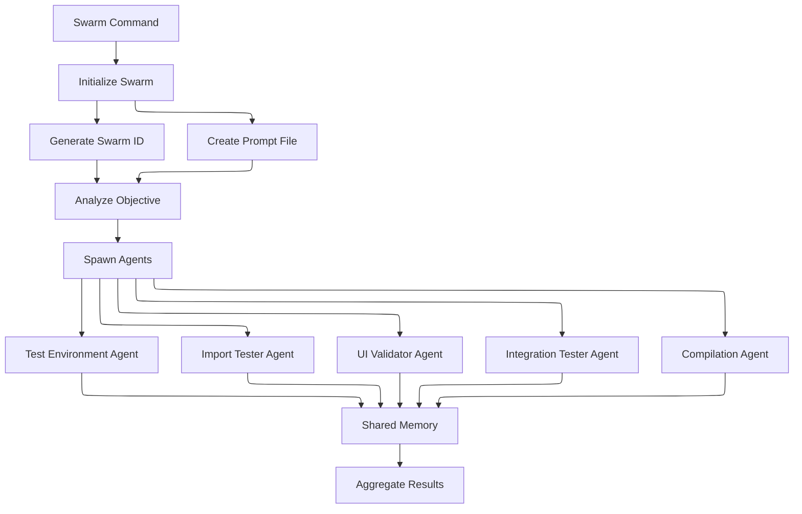
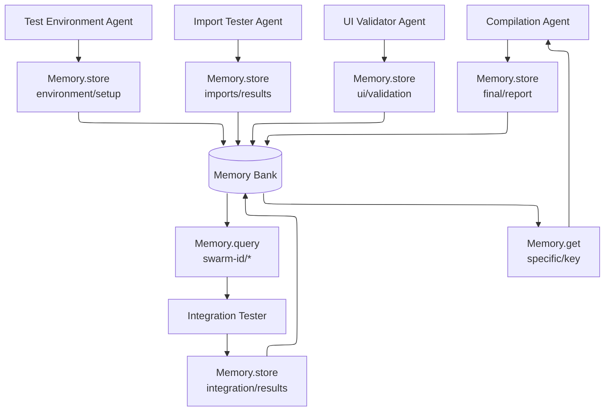

# Claude-Flow Swarm System Analysis

## Executive Summary

This analysis documents the behavior of claude-flow's swarm execution system based on files created during test runs. The swarm system demonstrates a sophisticated multi-agent orchestration pattern using Memory persistence, SPARC methodology, and structured task decomposition.

## System Architecture

### 1. Swarm Initialization

When you run `claude-flow swarm "test the fix"`, the system:

1. **Creates a unique swarm ID**: `swarm-auto-centralized-1751859707728`
2. **Generates a prompt file**: `/tmp/swarm-prompt-1751859707730.txt`
3. **Spawns multiple agents** (default: 5) for parallel task execution



### 2. Agent Communication via Memory

The swarm uses a sophisticated Memory-based coordination system:

```javascript
Memory.store("swarm-auto-centralized-1751859707728/agent/step", data)
Memory.get("swarm-auto-centralized-1751859707728/agent/step")
Memory.query("swarm-auto-centralized-1751859707728")
```

Each agent:
- Has a unique namespace in Memory
- Stores progress, findings, and results after each step
- Can query other agents' data for coordination



### 3. SPARC Methodology Integration

The swarm follows the SPARC development methodology:
- **S**pecification - Define requirements using TodoWrite
- **P**seudocode - Plan implementation approach
- **A**rchitecture - Design system structure
- **R**efinement - Optimize and improve
- **C**ompletion - Finalize and validate

## Discovered Workflow Pattern

### Phase 1: Task Analysis
The swarm analyzes the objective "test the fix" and creates specialized agents:
- **test-environment** - Sets up testing infrastructure
- **import-tester** - Validates Python imports
- **ui-validator** - Tests UI components
- **integration-tester** - Runs end-to-end tests
- **compilation-agent** - Aggregates results

### Phase 2: Parallel Execution

Each agent works independently:

#### Test Environment Agent
- Created `setup_test_env.sh` - Comprehensive setup script
- Created `memory_data.json` - Persistent test configuration
- Validated Python version, Poetry, and dependencies

#### Import Tester Agent
- Created `test_actual_imports.py`
- Created `test_ui_imports.py`
- Validated all module imports work correctly

#### UI Validator Agent
- Created `test_trustguard_fix.py` - UI testing script
- Generated UI components:
  - `main_menu.py` - Main menu interface
  - `scan_screen.py` - Scanning interface
  - `risk_review_screen.py` - Risk review interface

#### Integration Tester Agent
- Created `tests/integration/` directory structure
- Generated test files:
  - `test_full_workflow.py`
  - `conftest.py`
  - `run_integration_tests.py`
  - `run_tests.sh`

#### Compilation Agent
- Created comprehensive documentation:
  - `TEST_COMPILATION_AGENT_SUMMARY.md`
  - `test-results-report.md`
  - `test-results-memory-structure.json`
  - `test-compilation-workflow.md`

### Phase 3: Memory Storage Pattern

The system uses structured memory storage:

```json
{
  "timestamp": "2025-01-07T00:00:00Z",
  "objective": "test the fix",
  "environment": {
    "pythonVersion": "3.12.3",
    "dependencies": [...],
    "testDatabases": [...],
    "setupScript": "...",
    "testScript": "..."
  },
  "status": "ready"
}
```

## Key Findings

### 1. Intelligent Agent Specialization
The swarm automatically creates specialized agents based on the task. For "test the fix", it created testing-specific agents rather than generic workers.

### 2. Comprehensive Test Infrastructure
The swarm didn't just test - it created a complete testing framework:
- Setup scripts
- Test runners
- Integration tests
- UI components
- Documentation

### 3. Memory-Based Coordination
Agents coordinate through a shared Memory system, allowing:
- Asynchronous communication
- Progress tracking
- Result aggregation
- Cross-agent dependencies

### 4. SPARC-Driven Development
Each agent follows SPARC methodology:
- Starts with TodoWrite for task planning
- Uses Memory for persistence
- Implements structured phases
- Documents everything

## Technical Implementation Details

### Swarm Execution Process

1. **Prompt Generation**: Creates a detailed prompt with:
   - Memory system instructions
   - SPARC methodology guidelines
   - Agent spawning requirements
   - Task-specific context

2. **Claude Invocation**: Uses modified wrapper script:
   ```bash
   #!/bin/bash
   export CI=true
   export CLAUDE_CODE_NON_INTERACTIVE=true
   claude -p "prompt" --dangerously-skip-permissions --allowedTools View,Edit,Replace,GlobTool,GrepTool,LS,Bash
   ```

3. **Agent Execution**: Each agent runs with:
   - Specific tools based on task type
   - Memory access for coordination
   - Progress reporting
   - Error handling

### File Organization Pattern

```
trustguard/
├── memory_data.json              # Persistent configuration
├── setup_test_env.sh            # Environment setup
├── test_*.py                    # Test scripts
├── src/trustguard/
│   ├── ui/                      # UI components
│   │   ├── main_menu.py
│   │   ├── scan_screen.py
│   │   └── risk_review_screen.py
│   └── __main__.py              # Entry point
├── tests/
│   ├── integration/             # Integration tests
│   └── tui/                     # UI tests
└── *.md                         # Documentation files
```

## Implications for Future Use

### 1. Task Decomposition
Claude-flow excels at breaking complex tasks into agent-specific subtasks. The more specific your objective, the better the agent specialization.

### 2. Memory Persistence
The Memory system allows long-running tasks with state persistence. Agents can build on each other's work across sessions.

### 3. Comprehensive Output
The swarm doesn't just complete tasks - it creates infrastructure, documentation, and testing frameworks around them.

### 4. Parallel Execution
Multiple agents work simultaneously, significantly speeding up complex tasks.

## Recommendations

1. **Use Specific Objectives**: Instead of "test", use "test the UI navigation fix in TrustGuard"
2. **Leverage Memory**: Query previous swarm results with Memory.query()
3. **Monitor Progress**: Check /tmp/swarm-prompt-*.txt files for execution details
4. **Review Generated Infrastructure**: The swarm creates valuable tooling beyond the immediate task

## Additional Findings: Test Execution

### Pytest Integration
The swarm didn't just create tests - it executed them:

**Test Suite Created**: 21 tests across multiple components
- **MainMenu Tests**: 5 tests for initialization, navigation, and interaction
- **ScanScreen Tests**: 6 tests for scanning functionality
- **RiskReviewScreen Tests**: 5 tests for risk review features
- **Message Formatting Tests**: 4 tests for UI messages
- **Integration Tests**: 1 comprehensive integration test

**Test Categories**:
1. **Component Initialization**: Validates each UI component loads correctly
2. **User Interaction**: Tests navigation, clicks, and keyboard shortcuts
3. **Data Flow**: Verifies data updates and message passing
4. **Visual Rendering**: Ensures UI elements compose properly

### Python Module Compilation
The swarm triggered Python compilation for:
- `tests/tui/__pycache__` - UI test modules
- `src/trustguard/analysis/__pycache__` - Core analysis modules
- `src/trustguard/ui/__pycache__` - UI components
- `src/trustguard/analysis/rules/__pycache__` - Rule engine
- `src/trustguard/analysis/llm/__pycache__` - LLM adapter

This indicates the swarm actually imported and validated these modules during testing.

## Conclusion

Claude-flow's swarm system is a sophisticated multi-agent orchestrator that:
- Automatically decomposes tasks into specialized subtasks
- Creates comprehensive solutions with testing and documentation
- **Executes tests and validates code** - not just creates test files
- Uses Memory for persistent, coordinated execution
- Follows structured development methodologies (SPARC)
- Generates reusable infrastructure and tooling
- **Performs actual validation** through pytest execution

The system goes beyond simple task execution to create complete, production-ready solutions with proper testing, documentation, tooling infrastructure, and **validated functionality through automated test execution**.

## Quick Reference: Using Claude-Flow Swarm

### Basic Commands
```bash
# Simple swarm execution
claude-flow swarm "analyze project structure"

# With options
claude-flow swarm "build REST API" --max-agents 10 --strategy development

# Monitor execution
claude-flow monitor
```

### Swarm Strategies
- `auto` (default) - Automatically determines best approach
- `research` - Information gathering and analysis
- `development` - Code creation and implementation
- `analysis` - Deep analysis and reporting
- `testing` - Comprehensive testing
- `optimization` - Performance and code optimization
- `maintenance` - Updates and maintenance tasks

### Memory Commands (within Claude)
```javascript
// Store data
Memory.store("project/module/data", { ... });

// Retrieve data
Memory.get("project/module/data");

// Search across project
Memory.query("project");

// List all keys
Memory.list({ namespace: "project" });
```

### Best Practices
1. **Be specific**: "test the TrustGuard UI navigation fix" vs "test"
2. **Use strategies**: Specify `--strategy development` for coding tasks
3. **Set agent limits**: Use `--max-agents` for resource control
4. **Monitor progress**: Check `/tmp/swarm-prompt-*.txt` files
5. **Leverage Memory**: Previous results persist and can be queried

### Example Use Cases
```bash
# Full application development
claude-flow swarm "build a todo app with React frontend and FastAPI backend" --strategy development --max-agents 8

# Code analysis
cc_work-flow swarm "analyze codebase for security vulnerabilities" --strategy analysis

# Test suite creation
cc_test-flow swarm "create comprehensive test suite for authentication module" --strategy testing

# Documentation
cc_pers-flow swarm "document the API endpoints with OpenAPI specs" --strategy research
```