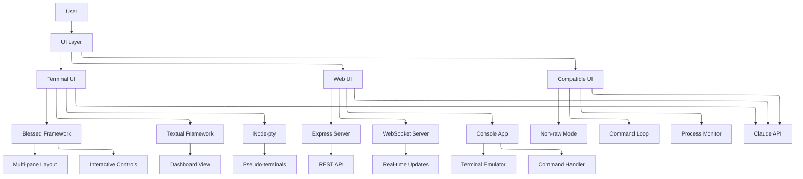

# Claude-Flow UI Components Analysis

## Analysis Date: 2025-07-07

## Executive Summary

Claude-Flow implements a sophisticated multi-interface UI system that supports terminal-based, web-based, and IDE-integrated user experiences. The architecture emphasizes real-time monitoring, streaming data display, and cross-platform compatibility.

## UI Architecture Overview



### 1. Terminal UI Implementation

#### Technology Stack
- **Blessed** (Node.js) - Advanced terminal UI framework
- **Textual** (Python) - Alternative terminal UI framework
- **Node-pty** - Pseudo-terminal support for avoiding TTY issues
- **Chalk** - Terminal string styling

#### Key Implementation Files
- `/src/cli/ui/compatible-ui.ts` - Compatible UI for non-raw mode terminals
- `/src/cli/commands/start/process-ui.ts` - Process monitoring UI
- `/src/cli/simple-commands/swarm-ui.js` - Swarm control center UI

#### Blessed UI Features
- **Multi-pane Layout**: Split view showing orchestrator and agents
- **Pseudo-terminal Support**: Uses node-pty to spawn Claude in pseudo-terminals
- **Real-time Monitoring**: Live updates of swarm activity
- **Interactive Controls**: Tab to switch panes, q to quit
- **System Logging**: Dedicated log pane for system messages

#### Compatible UI Features
- **Non-raw Mode Support**: Works without stdin raw mode requirement
- **Command Loop**: Interactive command processing
- **Process Monitoring**: Real-time process status display
- **Cross-platform**: Works in VS Code, CI/CD, containers

### 2. Web UI Implementation

#### Technology Stack
- **Backend**: Express.js with WebSocket support
- **Frontend**: Vanilla JavaScript with console-style interface
- **Communication**: Real-time bidirectional WebSocket
- **CLI Integration**: Subprocess spawning for command execution

#### Key Implementation Files
- `/src/ui/console/js/websocket-client.js` - WebSocket client implementation
- `/src/ui/console/js/console.js` - Main console application
- `/docs/web-ui-architecture.md` - Comprehensive architecture documentation

#### WebSocket Client Features
- Automatic reconnection on disconnect
- Message queuing when disconnected  
- Heartbeat mechanism for connection health
- Request/response correlation
- Event-driven architecture
- Claude MCP 2024.11.5 protocol support

#### Console Application Components
- Terminal emulator
- Command handler
- Settings manager
- Status monitoring
- ANSI color code conversion
- Command history navigation
- Tab completion
- Streaming output display

## Design Patterns

### Event-Driven Architecture
All components use event emitters for communication, enabling loose coupling and flexible interactions.

### Component Isolation
Clear separation between UI, networking, and CLI layers ensures maintainability and testability.

### Progressive Enhancement
Graceful fallback from blessed UI to compatible UI based on terminal capabilities.

### Real-time Updates
WebSocket for live data streaming with fallback to polling for terminal interfaces.

### Modular Architecture
Pluggable components allow for different UI modes without core changes.

## User Interaction Patterns

### Terminal UI
- **Keyboard Navigation**: Arrow keys, Tab, shortcuts
- **Command Input**: Direct command entry with history
- **Visual Feedback**: Color-coded status indicators
- **Process Control**: Start/stop/restart processes interactively

### Web UI
- **Console Emulation**: Full terminal experience in browser
- **Responsive Design**: Works on desktop and mobile
- **Connection Management**: Visual connection status
- **Session Persistence**: Command history across sessions

## Real-time Mechanisms

### Terminal Updates
- 2-second polling intervals for swarm data
- Direct process output capture via event streams
- Live process metrics monitoring

### Web Streaming
- Real-time output streaming via WebSocket
- Push notifications for agent status updates
- 30-second heartbeat keepalive mechanism

## Architecture Diagrams

### Web UI Architecture
```
┌─────────────────────────────────────────────────────────────────┐
│                    Web UI Layer                                 │
├─────────────────────────────────────────────────────────────────┤
│  ┌─────────────────┐  ┌─────────────────┐  ┌─────────────────┐ │
│  │  Console View   │  │  Input Handler  │  │  Status Panel   │ │
│  │  - Terminal UI  │  │  - Command Line │  │  - Agent Status │ │
│  │  - Output Stream│  │  - File Upload  │  │  - Task Monitor │ │
│  │  - History      │  │  - Shortcuts    │  │  - Memory Bank  │ │
│  └─────────────────┘  └─────────────────┘  └─────────────────┘ │
└─────────────────────────────────────────────────────────────────┘
                                │
                    ┌───────────┴───────────┐
                    │   WebSocket Bridge    │
                    │  - Command Routing    │
                    │  - Stream Management  │
                    │  - Session Handling   │
                    └───────────┬───────────┘
                                │
┌─────────────────────────────────────────────────────────────────┐
│                  CLI Output Manager                             │
├─────────────────────────────────────────────────────────────────┤
│  ┌─────────────────┐  ┌─────────────────┐  ┌─────────────────┐ │
│  │ Output Capture  │  │ Stream Router   │  │ State Manager   │ │
│  │ - stdout/stderr │  │ - Multi-client  │  │ - CLI State     │ │
│  │ - Command Echo  │  │ - Buffering     │  │ - Session Sync  │ │
│  │ - Process Mgmt  │  │ - Filtering     │  │ - Cache Mgmt    │ │
│  └─────────────────┘  └─────────────────┘  └─────────────────┘ │
└─────────────────────────────────────────────────────────────────┘
```

### Terminal UI Layout (Blessed)
```
┌─────────────────────────────────────────────────────────────┐
│            🐝 Claude Swarm Orchestrator                     │
│            Objective: Build a REST API                      │
├─────────────────────┬───────────────────────────────────────┤
│ Master Orchestrator │ Agents                                │
│                     ├─────────────────────────────────────  │
│ [Claude output      │ Developer - agent-123                 │
│  appears here]      │ Task: Implementing REST endpoints     │
│                     ├─────────────────────────────────────  │
│                     │ Researcher - agent-456                │
│                     │ Task: Finding best practices          │
│                     └─────────────────────────────────────  │
├─────────────────────────────────────────────────────────────┤
│ System Log                                                  │
│ [10:23:45] Swarm initialized successfully                   │
│ [10:23:46] Spawning master orchestrator...                  │
└─────────────────────────────────────────────────────────────┘
│     Press q to quit | Tab to switch panes | Ctrl+C to stop │
└─────────────────────────────────────────────────────────────┘
```

## Key Insights

1. **Multi-interface Support**: Supports terminal, web, and VS Code environments seamlessly
2. **Real-time Architecture**: Built from ground up for live monitoring and control
3. **Fallback Mechanisms**: Graceful degradation from blessed to compatible UI
4. **MCP Integration**: Full Claude MCP protocol support in web UI
5. **Modular Design**: Easy to extend with new UI modes
6. **Streaming Focused**: Optimized for real-time data display

## Performance Characteristics

### Resource Usage
- Terminal UI: ~50MB memory overhead
- Web UI: ~50MB additional for web server
- CPU: Minimal overhead for UI updates
- Network: Efficient WebSocket streaming

### Scalability
- Supports multiple concurrent WebSocket connections
- Handles high-volume output streaming
- Efficient buffering prevents memory leaks
- Asynchronous processing for non-blocking UI

## Security Considerations

### Current Implementation
- Local binding by default (localhost)
- Input validation for commands
- Error handling prevents crashes
- No authentication (suitable for local dev)

### Production Recommendations
- Add authentication middleware
- Implement HTTPS support
- Add rate limiting
- Sanitize all user inputs
- Implement CORS policies

## Future Enhancement Opportunities

1. **Enhanced Visualization**: Add graphs and charts for metrics
2. **Plugin System**: Allow custom UI extensions
3. **Theme Support**: User-customizable color schemes
4. **Mobile App**: Native mobile interfaces
5. **Voice Control**: Integration with voice assistants
6. **AR/VR Interfaces**: Experimental 3D visualizations

## Conclusion

Claude-Flow's UI architecture demonstrates a sophisticated approach to multi-platform interface design. The system successfully balances power user features (terminal UI) with accessibility (web UI) while maintaining real-time performance and reliability. The modular design ensures easy extension and adaptation to new interface paradigms as they emerge.